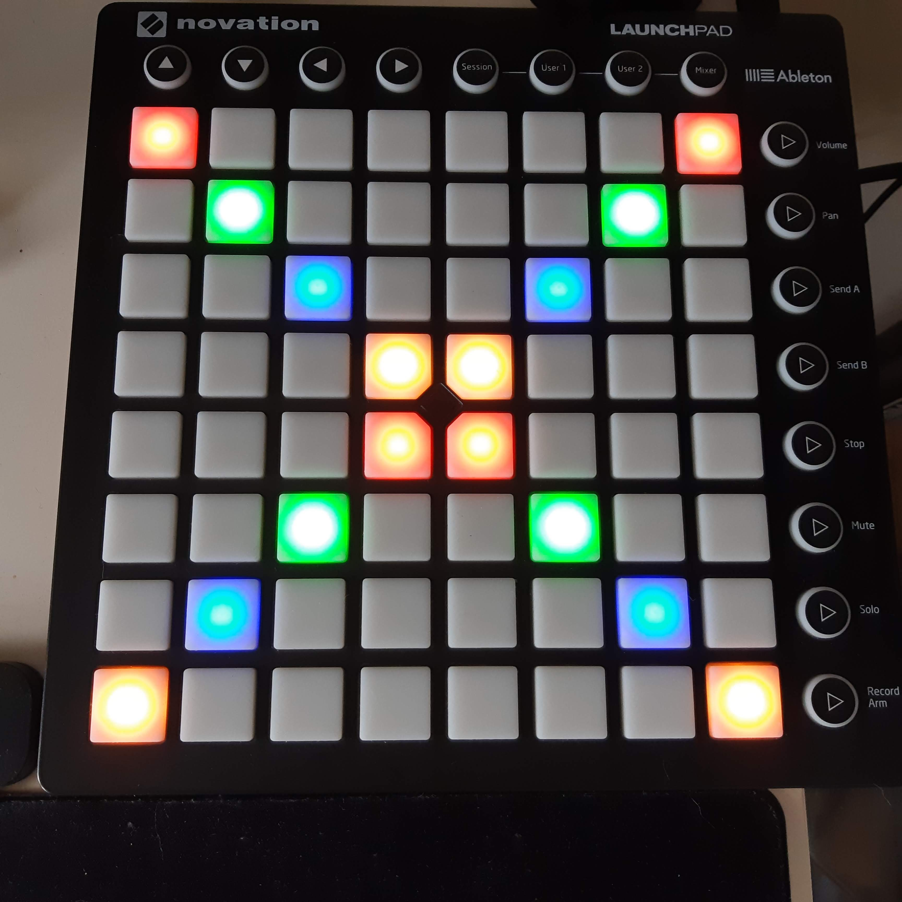

# Launchpad.js

Interact with your launchpads in Node.js

Launchpad running an [example script](./examples/example.js)

  

This project started as a module for my own stream system to make several things interact with OBS studio, named [rewards-interaction][rewards-interaction].
After re-writing a broken launchpad library I decided to release the library to the public so everyone can enjoy easy programming on their launchpad.

Some sample programs can be found in the [examples folder](./examples).

### Launchpad models currently supported
- Launchpad MK2

##### Why are only these launchpads supported?
These launchpads are supported because I own them myself and have been able to test them.
If a launchpad is not listed here it means that I do not own one and have not been able to test that one with the program.

### Notice
This project contains modified code from https://github.com/Lokua/launchpad which was released under the MIT license

[rewards-interaction]: https://github.com/duncte123/rewards-interaction
