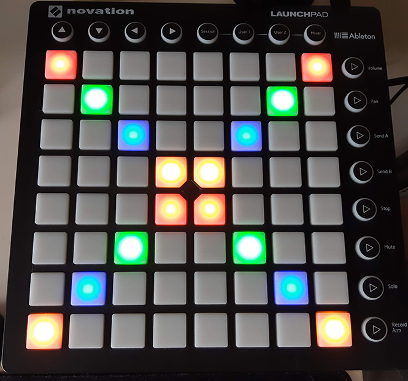

# Launchpad.js

Interact with your launchpads in Node.js

Launchpad running an [example script](./examples/example.js)


This project started as a module for my own stream system to make several things interact with OBS studio, named [rewards-interaction][rewards-interaction].
After re-writing a broken launchpad library I decided to release the library to the public so everyone can enjoy easy programming on their launchpad.

Some sample programs can be found in the [examples folder](./examples).

### Launchpad models currently supported
- Launchpad MK2

##### Why are only these launchpads supported?
These launchpads are supported because I own them myself and have been able to test them.
If a launchpad is not listed here it means that I do not own one and have not been able to test that one with the program.

### Examples
More examples can be found in the [examples folder](./examples), this is just a simple button listener.
```js
const { LaunchpadMK2, colors } = require('launchpad.js');
const { colorFromHex, defaultColors } = colors;

// we are enabling xyMode here
const lp = new lpJs.LaunchpadMK2({ xyMode: true });

lp.once('ready', (deviceName) => {
  console.log(`${deviceName} is ready!!`);

  lp.on('buttonDown', (button, value) => {
    // generate a random color on each button press
    const randHex = Math.floor(Math.random() * 16777215).toString(16);
    // we have the parse the colors to a special RGB value as
    // the launchpad does not go from 0-255 but from 0-63 for each color
    const color = colorFromHex(randHex);

    console.log('Button pressed: ' + button);

    lp.setButtonColor(button, color);
  });

  lp.on('buttonUp', (button, value) => {
    lp.setButtonColor(button, defaultColors.off);
  });
});
```

## TODO:
- Add support for the same launchpads as launchpad.py

### Links
Launchpad developer manual: https://resource.novationmusic.com/support/product-downloads?product=Launchpad

### Notice
This project contains modified code from https://github.com/Lokua/launchpad which was released under the MIT license

[rewards-interaction]: https://github.com/duncte123/rewards-interaction
